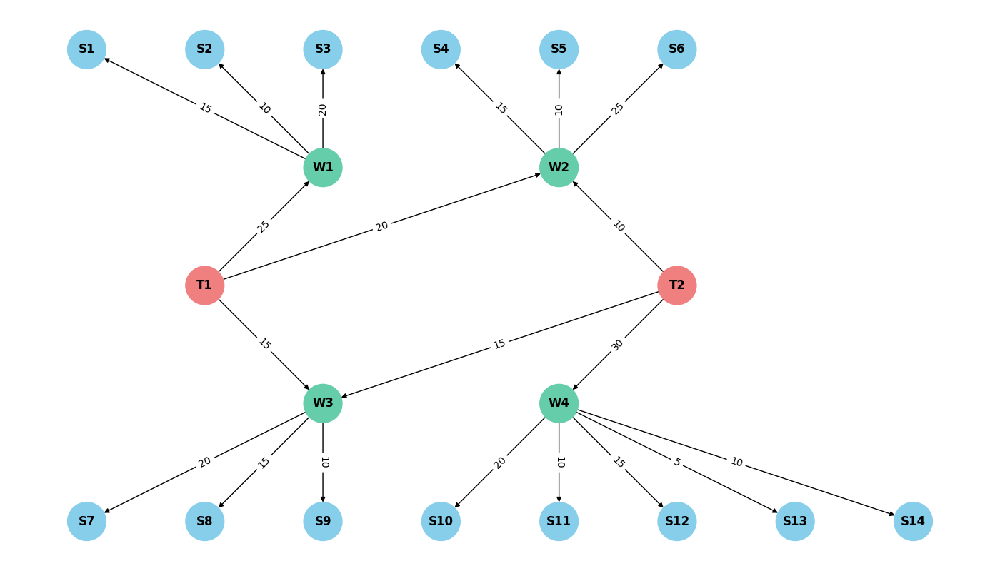

# Design and Analysis of Algorithms HW3 - Graphs and B-Trees

## Edmonds–Karp algorithm 

### Logistics network diagram
* T - terminals
* W - Warehouses
* S - Stores



### Results
| Terminal | Store    |  Max Flow |
|----------|----------|----------:|
| T1       | S1       |        15 |
| T1       | S2       |        10 |
| T1       | S3       |        20 |
| T1       | S4       |        15 |
| T1       | S5       |        10 |
| T1       | S6       |        20 |
| T1       | S7       |        15 |
| T1       | S8       |        15 |
| T1       | S9       |        10 |
| T2       | S4       |        10 |
| T2       | S5       |        10 |
| T2       | S6       |        10 |
| T2       | S7       |        15 |
| T2       | S8       |        15 |
| T2       | S9       |        10 |
| T2       | S10      |        20 |
| T2       | S11      |        10 |
| T2       | S12      |        15 |
| T2       | S13      |         5 |
| T2       | S14      |        10 |

### Conclusions
1. The total outgoing flows of the terminals are approximately equal \
T1 - 60 \
T2 - 55 \
The total flows from terminals to stores are equal \
T1 - 130 \
T2 - 130 \
Incoming flows of stores are 2 times higher than outgoing flows of terminals 
2. Routes between Terminal T1 and Shops S1, S2, S3 have zero flow \
Routes between Terminal T2 and shops S10, S11, S12, S13, S14 also have zero flow \
Route T1 -> S6 has bottleneck and can be improved by increasing the flow between T1 and W2 from 20 to 25 \
Route T2 -> S6 has bottleneck and can be improved by increasing the flow between T2 and W2 from 10 to 25 \
Route T1 -> S7 has bottleneck and can be improved by increasing the flow between T1 and W3 from 15 to 20 \
Route T2 -> S7 has bottleneck and can be improved by increasing the flow between T2 and W3 from 15 to 20
3. Stores received the smallest number of goods \
S13 - 5 \
S2, S11, S14 - 10
4. Incoming / outgoing flows for warehouses \
W1 ... 25 / 45 = 0.55 \
W2 ... 30 / 50 = 0.6 \
W3 ... 30 / 45 = 0.66 \
W4 ... 30 / 60 = 0.5 \
If we build an additional flow of 20 goods from Terminal T2 to Warehouse W1, we can increase the flow of Store S2 to 20 and improve the service of stores S1, S3 \
If we build an additional flow of 20 goods from Terminal T1 to Warehouse W4, we can increase the flow of Stores S11, S13, S14 to 15 and improve the service of stores S10, S12

## B-Tree and Dictionary comparison
The test results show that BTree is 5456 times more effective than standard Python dictionary
```bash
Total time for OOBTree: 0.1649 ms
Total time for Dict: 717.7384 ms
```